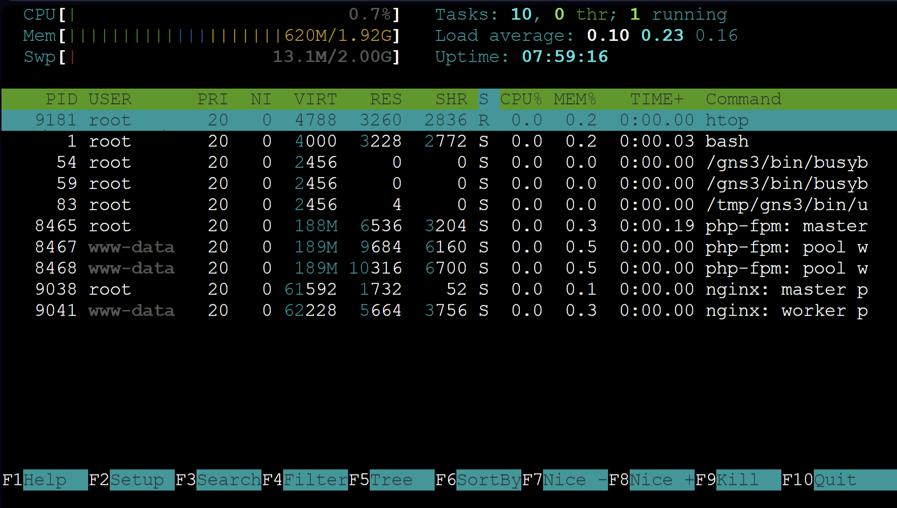
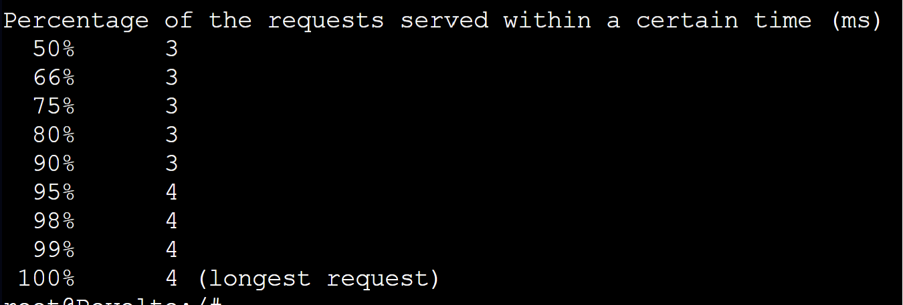

# Jarkom-Modul-3-B03-2023

## Anggota Kelompok
| Nama | NRP |
|---------------------------|------------|
|Wan Sabrina Mayzura | 5025211023 |
|Syarifah Talitha Erfany | 5025211175 |

## Daftar Isi
- [Daftar Isi](#daftar-isi)
  - [Topologi](#topologi)
  - [Config](#config)
  - [Grimoire](#grimoire)
- [Soal 1](#Soal-1)
  - [Script](#script)
  - [Result](#result)
- [Soal 2](#Soal-2)
  - [Script](#script-1)
- [Soal 3](#Soal-3)
  - [Script](#script-2)
- [Soal 4](#Soal-4)
  - [Script](#script-3)
  - [Result](#result-1)
- [Soal 5](#Soal-5)
  - [Script](#script-4)
  - [Result](#result-2)
- [Soal 6](#Soal-6)
  - [Script](#script-5)
  - [Result](#result-3)
- [Soal 7](#Soal-7)
  - [Script](#script-6)
  - [Result](#result-4)
- [Soal 8](#Soal-8)
  - [Script](#script-7)
  - [Result](#result-5)
- [Soal 9](#Soal-9)
  - [Script](#script-8)
  - [Result](#result-6)
- [Soal 10](#Soal-10)
  - [Script](#script-9)
  - [Result](#result-7)
- [Soal 11](#Soal-11)
  - [Script](#script-10)
  - [Result](#result-8)
- [Soal 12](#Soal-12)
  - [Script](#script-11)
  - [Result](#result-9)
- [Soal 13](#Soal-13)
  - [Script](#script-12)
  - [Result](#result-10)
- [Soal 14](#Soal-14)
  - [Script](#script-13)
  - [Result](#result-11)
- [Soal 15](#Soal-15)
  - [Script](#script-14)
  - [Result](#result-12)
- [Soal 16](#Soal-16)
  - [Script](#script-15)
  - [Result](#result-13)
- [Soal 17](#Soal-17)
  - [Script](#script-16)
  - [Result](#result-14)
- [Soal 18](#Soal-18)
  - [Script](#script-17)
  - [Result](#result-15)
- [Soal 19](#Soal-19)
  - [Script](#script-18)
  - [Result](#result-16)
- [Soal 20](#Soal-20)
  - [Script](#script-19)
  - [Result](#result-17)

## Topologi


## Config 
- **Aura (Router & DHCP relay)**
  ```
  # DHCP config for eth0
  auto eth0
  iface eth0 inet dhcp
  up iptables -t nat -A POSTROUTING -o eth0 -j MASQUERADE -s 10.10.0.0/16

  # Static config for eth1
  auto eth1
  iface eth1 inet static
    address 10.10.1.35
    netmask 255.255.255.0

  # Static config for eth2
  auto eth2
  iface eth2 inet static
    address 10.10.2.35
    netmask 255.255.255.0

  # Static config for eth3
  auto eth3
  iface eth3 inet static
    address 10.10.3.35
    netmask 255.255.255.0

  # Static config for eth4
  auto eth4
  iface eth4 inet static
    address 10.10.4.35
    netmask 255.255.255.0
  ```
- **Himmel (DHCP Server)**
  ```
  auto eth0
  iface eth0 inet static
    address 10.10.1.1
    netmask 255.255.255.0
    gateway 10.10.1.35
  ```
- **Heiter (DNS Server)**
  ```
  auto eth0
  iface eth0 inet static
    address 10.10.1.2
    netmask 255.255.255.0
    gateway 10.10.1.35
  ```
- **Denken (Database Server)**
  ```
  auto eth0
  iface eth0 inet static
    address 10.10.2.1
    netmask 255.255.255.0
    gateway 10.10.2.35
  ```
- **Eisen (Load Balancer)**
  ```
  auto eth0
  iface eth0 inet static
    address 10.10.2.2
    netmask 255.255.255.0
    gateway 10.10.2.35
  ```
- **Revolte (Client)**
  ```
  auto eth0
  iface eth0 inet dhcp
  ```
- **Richter (Client)**
  ```
  auto eth0
  iface eth0 inet dhcp
  hwaddress ether 96:05:97:2a:29:65
  ```
- **Lawine (PHP Worker)**
  ```
  auto eth0
  iface eth0 inet dhcp
  hwaddress ether 3a:ff:68:ce:d5:cf
  ```
- **Linie (PHP Worker)**
  ```
  auto eth0
  iface eth0 inet dhcp
  hwaddress ether 76:a0:85:61:16:3e
  ```
- **Lugner (PHP Worker)**
  ```
  auto eth0
  iface eth0 inet dhcp
  hwaddress ether 1e:9d:8e:94:86:46
  ```
- **Sein (Client)**
  ```
  auto eth0
  iface eth0 inet dhcp
  ```
- **Stark (Client)**
  ```
  auto eth0
  iface eth0 inet dhcp
  ```
- **Frieren (Laravel Worker)**
  ```
  auto eth0
  iface eth0 inet dhcp
  hwaddress ether be:6a:9c:c4:ae:30
  ```
- **Flemme (Laravel Worker)**
  ```
  auto eth0
  iface eth0 inet dhcp
  hwaddress ether c6:30:18:d2:fd:9a
  ```
- **Fern (Laravel Worker)**
  ```
  auto eth0
  iface eth0 inet dhcp
  hwaddress ether a2:e5:59:6d:aa:80
  ```

## Grimoire

Berikut adalah link grimoire kami :

[B03_Grimoire - Google Dokumen](https://docs.google.com/document/d/14eB-HuHSTERqzkfAw5me3RXB4M3lnfnk3INkxqq9alc/edit?usp=sharing)

## Soal 1
> Lakukan konfigurasi sesuai dengan peta yang sudah diberikan.

### Script
**Di Heiter** masukkan konfigurasi domainnya
- granz.channel.B03.com

```
;
; BIND data file for local loopback interface
;
$TTL    604800
@       IN      SOA     granz.channel.B03.com. root.granz.channel.B03.com. (
                        2023131101      ; Serial
                         604800         ; Refresh
                          86400         ; Retry
                        2419200         ; Expire
                         604800 )       ; Negative Cache TTL
;
@               IN      NS      granz.channel.B03.com.
@               IN      A       10.10.3.1       ; IP fern
www             IN      CNAME   granz.channel.B03.com.
```

- riegel.canyon.B03.com
```
;
; BIND data file for local loopback interface
;
$TTL    604800
@       IN      SOA     riegel.canyon.B03.com. root.riegel.canyon.B03.com. (
                        2023131101      ; Serial
                         604800         ; Refresh
                          86400         ; Retry
                        2419200         ; Expire
                         604800 )       ; Negative Cache TTL
;
@               IN      NS      riegel.canyon.B03.com.
@               IN      A       10.10.4.1       ; IP lugner
www             IN      CNAME   riegel.canyon.B03.com.
```

### Result
Melakukan percobaan di client `Stark`


## Soal 2
> Client yang melalui Switch3 mendapatkan range IP dari [prefix IP].3.16 - [prefix IP].3.32 dan [prefix IP].3.64 - [prefix IP].3.80

Memasukkan konfigurasi kedalam `/etc/dhcp/dhcpd.conf`

### Script
```
# eth1
subnet 10.10.1.0 netmask 255.255.255.0 {
}

	# eth2
subnet 10.10.2.0 netmask 255.255.255.0 {
}

# eth3
subnet 10.10.3.0 netmask 255.255.255.0 {
    range 10.10.3.16 10.10.3.32;
    range 10.10.3.64 10.10.3.80;
    option routers 10.10.3.35;
    option broadcast-address 10.10.3.255;
    option domain-name-servers 10.10.1.2;
    default-lease-time 180;
    max-lease-time 5760;
}
```

## Soal 3
> Client yang melalui Switch4 mendapatkan range IP dari [prefix IP].4.12 - [prefix IP].4.20 dan [prefix IP].4.160 - [prefix IP].4.168

Memasukkan konfigurasi `eth4` kedalam `/etc/dhcp/dhcpd.conf`

### Script
```
# eth1
subnet 10.10.1.0 netmask 255.255.255.0 {
}

	# eth2
subnet 10.10.2.0 netmask 255.255.255.0 {
}

# eth3
subnet 10.10.3.0 netmask 255.255.255.0 {
    range 10.10.3.16 10.10.3.32;
    range 10.10.3.64 10.10.3.80;
    option routers 10.10.3.35;
    option broadcast-address 10.10.3.255;
    option domain-name-servers 10.10.1.2;
    default-lease-time 180;
    max-lease-time 5760;
}

# eth4
subnet 10.10.4.0 netmask 255.255.255.0 {
    range 10.10.4.12 10.10.4.20;
    range 10.10.4.160 10.10.4.168;
    option routers 10.10.4.35;
    option broadcast-address 10.10.4.255;
    option domain-name-servers 10.10.1.2;
    default-lease-time 720;
    max-lease-time 5760;
```

## Soal 4
> Client mendapatkan DNS dari Heiter dan dapat terhubung dengan internet melalui DNS tersebut 

Memasukkan konfigurasi kedalam `/etc/dhcp/dhcpd.conf`, didalam `option broadcast-address` dan `option domain-name-servers` ditambahkan IP DNS dari Heiter.

### Script
```
# eth3
subnet 10.10.3.0 netmask 255.255.255.0 {
    . . .
    option broadcast-address 10.10.3.255;
    option domain-name-servers 10.10.1.2;
    . . .
}

# eth4
subnet 10.10.4.0 netmask 255.255.255.0 {
    . . .
    option broadcast-address 10.10.4.255;
    option domain-name-servers 10.10.1.2;
    . . .

```

### Result
Melakukan percobaan di client `Stark`


## Soal 5
> Lama waktu DHCP server meminjamkan alamat IP kepada Client yang melalui Switch3 selama 3 menit sedangkan pada client yang melalui Switch4 selama 12 menit. Dengan waktu maksimal dialokasikan untuk peminjaman alamat IP selama 96 menit

Memasukkan konfigurasi kedalam `/etc/dhcp/dhcpd.conf`, didalam `default-lease-time` dan `max-lease-time` disesuaikan dengan jumlah waktu yang diinginkan oleh soal. Adapun maksimal waktu antar 2 switch adalah `96 menit = 5760s`, Peminjaman melalui switch 3 selama `3 menit = 180s` dan peminjaman melalui switch4 selama `12 menit = 720s`.

### Script
```
# eth3
subnet 10.10.3.0 netmask 255.255.255.0 {
    . . .
    default-lease-time 180;
    max-lease-time 5760;
}

# eth4
subnet 10.10.4.0 netmask 255.255.255.0 {
    . . .
    default-lease-time 720;
    max-lease-time 5760;
```

### Result
Melakukan percobaan di client `Stark`


## Soal 6
> Pada masing-masing worker PHP, lakukan konfigurasi virtual host untuk website berikut dengan menggunakan php 7.3.

Pada soal ini akan melakukan clone dari github yang diberikan soal agar dapat mengerjakan soal nomor 6. Dalam nomor 6 ini memiliki konfigurasi nginx dan lynx sehingga harus menginstall lynx terlebih dahulu lalu dijalankan di PHP worker.

### Script
```
service nginx start

mkdir -p /var/www/granz.channel.B03.com

cp granz.channel.B03.com /etc/nginx/sites-available/granz.channel.B03.com
ln -s /etc/nginx/sites-available/granz.channel.B03.com /etc/nginx/sites-enabled/

apt-get update
apt-get install git -y

git -c http.sslVerify=false clone https://github.com/bombshelll/granz.channel.B03 .com /var/www/granz.channel.B03.com

rm -rf /etc/nginx/sites-enabled/default

service php7.3-fpm start
service nginx restart
```

### Result
Masukkan `lynx 10.10.3.1`, `lynx 10.10.3.2`, `lynx 10.10.3.3` pada masing-masing PHP worker


## Soal 7
> Kepala suku dari Bredt Region memberikan resource server sebagai berikut:
> - Lawine, 4GB, 2vCPU, dan 80 GB SSD.
> - Linie, 2GB, 2vCPU, dan 50 GB SSD.
> - Lugner 1GB, 1vCPU, dan 25 GB SSD.
>
>  aturlah agar Eisen dapat bekerja dengan maksimal, lalu lakukan testing dengan 1000 request dan 100 request/second.

Menggunakan algoritma roundrobin pada load balancer Eisen dimana pada Heiter diarahkan IP domein ke Eisen.

### Script
**Heiter (DNS Server)**
- no7.sh

```
;
; BIND data file for local loopback interface
;
$TTL    604800
@       IN      SOA     granz.channel.B03.com. root.granz.channel.B03.com. (
                        2023131101      ; Serial
                         604800         ; Refresh
                          86400         ; Retry
                        2419200         ; Expire
                         604800 )       ; Negative Cache TTL
;
@               IN      NS      granz.channel.B03.com.
@               IN      A       10.10.2.2       ; IP Eisen
www             IN      CNAME   granz.channel.B03.com.
```

**Eisen (Load Balancer)**
- lb-roundrobin
```
upstream worker {
    server 10.10.3.1;
    server 10.10.3.2;
    server 10.10.3.3;
}

server {
    listen 80;
    server_name granz.channel.B10.com www.granz.channel.B10.com;

    root /var/www/html;

    index index.html index.htm index.nginx-debian.html;

    server_name _;

    location / {
        proxy_pass http://worker_round_robin;
    }
}
```
- no8-roundrobin.sh
```
service nginx start

cp lb-roundrobin /etc/nginx/sites-available/lb-granz
rm -f /etc/nginx/sites-available/lb-granz
ln -s /etc/nginx/sites-available/lb-granz /etc/nginx/sites-enabled/

service nginx restart
```

**Revolte (Client)**

Masukkan perintah berikut, `1000 req 100 req/s`
```
ab -n 1000 -c 100 http://www.granz.channel.B03.com/
```

### Result


## Soal 8
> Karena diminta untuk menuliskan grimoire, buatlah analisis hasil testing dengan 200 request dan 10 request/second masing-masing algoritma Load Balancer dengan ketentuan sebagai berikut:
>
> - Nama Algoritma Load Balancer
> - Report hasil testing pada Apache Benchmark
> - Grafik request per second untuk masing masing algoritma. 
> - Analisis

Menggunakan algoritma roundrobin, least-connection, IP Hash, dan Generic Hash pada load balancer Eisen dimana pada Heiter diarahkan IP domein ke Eisen.

### Script
**Heiter (DNS Server)**
- no7.sh

```
;
; BIND data file for local loopback interface
;
$TTL    604800
@       IN      SOA     granz.channel.B03.com. root.granz.channel.B03.com. (
                        2023131101      ; Serial
                         604800         ; Refresh
                          86400         ; Retry
                        2419200         ; Expire
                         604800 )       ; Negative Cache TTL
;
@               IN      NS      granz.channel.B03.com.
@               IN      A       10.10.2.2       ; IP Eisen
www             IN      CNAME   granz.channel.B03.com.
```

**Eisen (Load Balancer)**
- lb-roundrobin
```
upstream worker {
    server 10.10.3.1;
    server 10.10.3.2;
    server 10.10.3.3;
}

server {
    listen 80;
    server_name granz.channel.B10.com www.granz.channel.B10.com;

    root /var/www/html;

    index index.html index.htm index.nginx-debian.html;

    server_name _;

    location / {
        proxy_pass http://worker_round_robin;
    }
}
```

- lb-leastconnection
```
upstream worker_least_conn {
    server 10.10.3.1;
    server 10.10.3.2;
    server 10.10.3.3;
}

server {
    listen 80;
    server_name granz.channel.B10.com www.granz.channel.B10.com;

    root /var/www/html;

    index index.html index.htm index.nginx-debian.html;

    server_name _;

    location / {
        proxy_pass http://worker_least_conn;
    }
}
```

- lb-iphash
```
upstream worker_ip_hash {
    server 10.10.3.1;
    server 10.10.3.2;
    server 10.10.3.3;
}

server {
    listen 80;
    server_name granz.channel.B10.com www.granz.channel.B10.com;

    root /var/www/html;

    index index.html index.htm index.nginx-debian.html;

    server_name _;

    location / {
        proxy_pass http://worker_ip_hash;
    }
}
```

- lb-generichash
```
upstream worker_generic_hash {
    server 10.10.3.1;
    server 10.10.3.2;
    server 10.10.3.3;
}

server {
    listen 80;
    server_name granz.channel.B10.com www.granz.channel.B10.com;

    root /var/www/html;

    index index.html index.htm index.nginx-debian.html;

    server_name _;

    location / {
        proxy_pass http://worker_generic_hash;
    }
}
```

- no8-roundrobin.sh
```
service nginx start

cp lb-roundrobin /etc/nginx/sites-available/lb-granz
rm -f /etc/nginx/sites-available/lb-granz
ln -s /etc/nginx/sites-available/lb-granz /etc/nginx/sites-enabled/

service nginx restart
```

- no8-leastconnection.sh
```
service nginx start

cp lb-leastconnection /etc/nginx/sites-available/lb-granz
rm -f /etc/nginx/sites-available/lb-granz
ln -s /etc/nginx/sites-available/lb-granz /etc/nginx/sites-enabled/

service nginx restart
```

- no8-iphash.sh
```
service nginx start

cp lb-iphash /etc/nginx/sites-available/lb-granz
rm -f /etc/nginx/sites-available/lb-granz
ln -s /etc/nginx/sites-available/lb-granz /etc/nginx/sites-enabled/

service nginx restart
```

- no8-generichash.sh
```
service nginx start

cp lb-generichash /etc/nginx/sites-available/lb-granz
rm -f /etc/nginx/sites-available/lb-granz
ln -s /etc/nginx/sites-available/lb-granz /etc/nginx/sites-enabled/

service nginx restart
```

**Revolte (Client)**

Masukkan perintah berikut, `200 req 10 req/s`
```
ab -n 200 -c 10 http://www.granz.channel.B03.com/
```

### Result
- Round Robin


- Lawine


- Linie



- Lugner


- Least Connection


- Lawine


- Linie


- Lugner


- IP Hash


- Lawine


- Linie


- Lugner


- Generic Hash




- Lawine


- Linie


- Lugner


## Soal 9
> Dengan menggunakan algoritma Round Robin, lakukan testing dengan menggunakan 3 worker, 2 worker, dan 1 worker sebanyak 100 request dengan 10 request/second, kemudian tambahkan grafiknya pada grimoire.

Menggunakan algoritma roundrobin pada load balancer Eisen dimana pada Heiter diarahkan IP domein ke Eisen.

### Script
**Heiter (DNS Server)**
- no7.sh

```
;
; BIND data file for local loopback interface
;
$TTL    604800
@       IN      SOA     granz.channel.B03.com. root.granz.channel.B03.com. (
                        2023131101      ; Serial
                         604800         ; Refresh
                          86400         ; Retry
                        2419200         ; Expire
                         604800 )       ; Negative Cache TTL
;
@               IN      NS      granz.channel.B03.com.
@               IN      A       10.10.2.2       ; IP Eisen
www             IN      CNAME   granz.channel.B03.com.
```

**Eisen (Load Balancer)**
- lb-roundrobin
```
upstream worker {
    server 10.10.3.1;
    server 10.10.3.2;
    server 10.10.3.3;
}

server {
    listen 80;
    server_name granz.channel.B10.com www.granz.channel.B10.com;

    root /var/www/html;

    index index.html index.htm index.nginx-debian.html;

    server_name _;

    location / {
        proxy_pass http://worker_round_robin;
    }
}
```
- no8-roundrobin.sh
```
service nginx start

cp lb-roundrobin /etc/nginx/sites-available/lb-granz
rm -f /etc/nginx/sites-available/lb-granz
ln -s /etc/nginx/sites-available/lb-granz /etc/nginx/sites-enabled/

service nginx restart
```

**Revolte (Client)**

Masukkan perintah berikut, `100 req 10 req/s`
```
ab -n 1000 -c 100 http://www.granz.channel.B03.com/
```

### Result
- 3 Worker


- Lawine


- Linie


- Lugner


- 2 Worker


- Lawine


- Linie


- 1 Worker


- Lawine


## Soal 10
> Selanjutnya coba tambahkan konfigurasi autentikasi di LB dengan dengan kombinasi username: “netics” dan password: “ajkyyy”, dengan yyy merupakan kode kelompok. Terakhir simpan file “htpasswd” nya di /etc/nginx/rahasisakita/

**Di Eisen (Load Balancer)**, jalankan command dibawah untuk membuat direktori untk menyimpan password, serta membuat username dan password untuk kredensial.
```shell
mkdir /etc/nginx/rahasisakita
htpasswd -c /etc/nginx/rahasisakita/htpasswd netics
```
Lalu masukkan password `ajkB03`.

Pada konfigurasi nginx, tambahkan command berikut:
```shell
auth_basic "Restricted Content";
auth_basic_user_file /etc/nginx/rahasisakita/htpasswd; 
```

Sehingga isi dari load balancer untuk nomor ini seperti berikut:
```shell
upstream worker_round_robin {
  server 10.10.3.1;
  server 10.10.3.2;
  server 10.10.3.3;
}

server {
    listen 80;
    server_name granz.channel.B03.com www.granz.channel.B03.com;

    root /var/www/html;

    index index.html index.htm index.nginx-debian.html;

    location / {
        proxy_pass http://worker_round_robin;
    }

    auth_basic "Restricted Content";
    auth_basic_user_file /etc/nginx/rahasisakita/htpasswd;
}
```

### Script di Eisen
```shell
service nginx start

cp lb-roundrobin-protected /etc/nginx/sites-available/lb-granz

rm -f /etc/nginx/sites-enabled/lb-granz
ln -s /etc/nginx/sites-available/lb-granz /etc/nginx/sites-enabled/

service nginx restart
```

### Testing di client (Revolte)
Jalankan `lynx www.granz.channel.B03.com`


## Soal 11
Lalu buat untuk setiap request yang mengandung /its akan di proxy passing menuju halaman https://www.its.ac.id. (11) hint: (proxy_pass)

**Di Eisen (Load Balancer)** tambahkan location untuk endpoint its pada konfigurasi nginx, seperti berikut:
```shell
upstream worker-its {
    server 10.10.3.1;
    server 10.10.3.2;
    server 10.10.3.3;
}

server {
    listen 80;
    server_name granz.channel.B03.com www.granz.channel.B03.com;

    root /var/www/html;
    index index.html index.htm index.nginx-debian.html;

    location / {
        proxy_pass http://worker-its;
    }

    location ~ /its {
        proxy_pass https://www.its.ac.id;
        proxy_set_header Host www.its.ac.id;
        proxy_set_header X-Real-IP $remote_addr;
        proxy_set_header X-Forwarded-For $proxy_add_x_forwarded_for;
        proxy_set_header X-Forwarded-Proto $scheme;
    }

    auth_basic "Restricted Content";
    auth_basic_user_file /etc/nginx/rahasisakita/htpasswd;
}
```

### Script di Eisen
```shell
service nginx start

cp lb-its /etc/nginx/sites-available/lb-granz

rm -f /etc/nginx/sites-enabled/lb-granz
ln -s /etc/nginx/sites-available/lb-granz /etc/nginx/sites-enabled/

service nginx restart
```

### Testing di client (Revolte)
Jalankan `lynx www.granz.channel.B03.com/its`


## Soal 12
Selanjutnya LB ini hanya boleh diakses oleh client dengan IP [Prefix IP].3.69, [Prefix IP].3.70, [Prefix IP].4.167, dan [Prefix IP].4.168. (12) hint: (fixed in dulu clinetnya)

**Di Himmel (DHCP SERVER)** kita harus melakukan fiksasi IP untuk salah satu client untuk mencoba IP dengan prefix di atas, kita akan menambahkan fixed address untuk client `Richter`. Pada dhcpd.conf, tambahkan baris berikut:

```shell
# RICHTER FIXED ADDRESS
host Richter {
    hardware ethernet 96:05:97:2a:29:65;
    fixed-address 10.10.3.69;
}
```

dimana kita membuat 10.10.3.69 sebagai IP static Richter, dan hwaddress didapatkan dengan menjalankan `ip a` di node Richter.

### Script di Himmel
```shell
cp 12-dhcpd.conf /etc/dhcp/dhcpd.conf
cp isc-dhcp-server /etc/default/isc-dhcp-server

service isc-dhcp-server restart
service isc-dhcp-server status
```

**Di Eisen (Load Balancer)** tambahkan baris berikut pada konfigurasi nginx:
```shell
  location / {
      allow 10.10.3.69;
      allow 10.10.3.70;
      allow 10.10.4.167;
      allow 10.10.4.168;
      deny all;
      proxy_pass http://worker-its;
  }
```
agar jika menjalankan `lynx www.granz.channel.B03.com/its` hanya bisa diakses oleh dan akan men-*deny* request dari IP selain dari IP yang sudah di specified di atas.

### Script di Eisen
```shell
service nginx start

cp lb-roundrobin-12 /etc/nginx/sites-available/lb-granz

rm -f /etc/nginx/sites-enabled/lb-granz
ln -s /etc/nginx/sites-available/lb-granz /etc/nginx/sites-enabled/

service nginx restart
```

### Testing di client Richter (IP 10.10.3.69)
Jalankan `lynx www.granz.channel.B03.com/its`


### Testing di client Revolte (IP dinamis)
 <br />
Sudah tidak bisa diakses.

## Soal 13
Semua data yang diperlukan, diatur pada Denken dan harus dapat diakses oleh Frieren, Flamme, dan Fern.

**Di Denken**, ada beberapa dependensi yang harus diinstall diantaranya:
```shell
apt-get update
apt-get install mariadb-server -y
service mysql start
```

Lalu lakukan konfigurasi pada beberapa file di bawah, seperti `my.cnf`:
```shell
[client-server]

!includedir /etc/mysql/conf.d/
!includedir /etc/mysql/mariadb.conf.d/

[mysqld]
skip-networking=0
skip-bind-address
```

pada file `50-server.cnf`, ubah `bind-address` menjadi `0.0.0.0`

Serta untuk menambah user dan database, jalankan script berikut:
```shell
cp 50-server.cnf /etc/mysql/mariadb.conf.d/50-server.cnf
cp my.cnf /etc/mysql/my.cnf

service mysql restart

#!/bin/bash

# Prompt for the MySQL root password
read -sp 'Enter MySQL root password: ' MYSQL_ROOT_PASSWORD
echo

# Execute MySQL commands
mysql -u root -p"$MYSQL_ROOT_PASSWORD" <<EOF
DROP USER IF EXISTS 'kelompokB03'@'%';
DROP USER IF EXISTS 'kelompokB03'@'localhost';
CREATE USER 'kelompokB03'@'%' IDENTIFIED BY 'passwordB03';
CREATE USER 'kelompokB03'@'localhost' IDENTIFIED BY 'passwordB03';
DROP DATABASE IF EXISTS dbkelompokB03;
CREATE DATABASE dbkelompokB03;
GRANT ALL PRIVILEGES ON dbkelompokB03.* TO 'kelompokB03'@'%';
GRANT ALL PRIVILEGES ON dbkelompokB03.* TO 'kelompokB03'@'localhost';
FLUSH PRIVILEGES;
EOF

echo "dbkelompokB03 created"
```

**Pada worker Laravel** (Frieren, Flemme, dan Fern) install dependensi berikut yang akan digunakan pada nomor ini dan nomor-nomor selanjutnya:
```shell
apt-get update

apt-get install mariadb-client -y

apt-get install -y lsb-release ca-certificates apt-transport-https software-properties-common gnupg2

curl -sSLo /usr/share/keyrings/deb.sury.org-php.gpg https://packages.sury.org/php/apt.gpg

sh -c 'echo "deb [signed-by=/usr/share/keyrings/deb.sury.org-php.gpg] https://packages.sury.org/php/ $(lsb_release -sc) main" > /etc/apt/sources.list.d/php.list'

apt-get update

apt-get install php8.0-mbstring php8.0-xml php8.0-cli php8.0-common php8.0-intl php8.0-opcache php8.0-readline php8.0-mysql php8.0-fpm php8.0-curl unzip wget -y
apt-get install nginx -y

wget https://getcomposer.org/download/2.0.13/composer.phar
chmod +x composer.phar
mv composer.phar /usr/bin/composer

apt-get install git -y

apt-get install lynx
```

Lalu untuk connect ke database, jalankan command berikut sekaligus untuk melihat list database yang telah dibuat:
```shell
mariadb --host=10.10.2.1 --port=3306 --user=kelompokB03 --password=passwordB03 dbkelompokB03 -e "SHOW DATABASES;"
```


## Soal 14
Frieren, Flamme, dan Fern memiliki Riegel Channel sesuai dengan quest guide berikut. Jangan lupa melakukan instalasi PHP8.0 dan Composer (14)

**Pada worker Laravel** (Frieren, Flemme, dan Fern), jalankan script berikut untuk melakukan deploy web Laravel yang di git clone dari sebuah repository:
```shell
apt-get install git -y
cd /var/www && git clone https://github.com/martuafernando/laravel-praktikum-jarkom
cd /var/www/laravel-praktikum-jarkom && composer update

cp .env.example .env
rm /var/www/laravel-praktikum-jarkom/public/storage

echo 'APP_NAME=Laravel
APP_ENV=local
APP_KEY=
APP_DEBUG=true
APP_URL=http://localhost

LOG_CHANNEL=stack
LOG_DEPRECATIONS_CHANNEL=null
LOG_LEVEL=debug

DB_CONNECTION=mysql
DB_HOST=10.10.2.1
DB_PORT=3306
DB_DATABASE=dbkelompokB03
DB_USERNAME=kelompokB03
DB_PASSWORD=passwordB03

BROADCAST_DRIVER=log
CACHE_DRIVER=file
FILESYSTEM_DISK=local
QUEUE_CONNECTION=sync
SESSION_DRIVER=file
SESSION_LIFETIME=120

MEMCACHED_HOST=127.0.0.1

REDIS_HOST=127.0.0.1
REDIS_PASSWORD=null
REDIS_PORT=6379

MAIL_MAILER=smtp
MAIL_HOST=mailpit
MAIL_PORT=1025
MAIL_USERNAME=null
MAIL_PASSWORD=null
MAIL_ENCRYPTION=null
MAIL_FROM_ADDRESS="hello@example.com"
MAIL_FROM_NAME="${APP_NAME}"

AWS_ACCESS_KEY_ID=
AWS_SECRET_ACCESS_KEY=
AWS_DEFAULT_REGION=us-east-1
AWS_BUCKET=
AWS_USE_PATH_STYLE_ENDPOINT=false

PUSHER_APP_ID=
PUSHER_APP_KEY=
PUSHER_APP_SECRET=
PUSHER_HOST=
PUSHER_PORT=443
PUSHER_SCHEME=https
PUSHER_APP_CLUSTER=mt1

VITE_PUSHER_APP_KEY="${PUSHER_APP_KEY}"
VITE_PUSHER_HOST="${PUSHER_HOST}"
VITE_PUSHER_PORT="${PUSHER_PORT}"
VITE_PUSHER_SCHEME="${PUSHER_SCHEME}"
VITE_PUSHER_APP_CLUSTER="${PUSHER_APP_CLUSTER}"' > /var/www/laravel-praktikum-jarkom/.env
cd /var/www/laravel-praktikum-jarkom && php artisan key:generate
cd /var/www/laravel-praktikum-jarkom && php artisan config:cache
cd /var/www/laravel-praktikum-jarkom && php artisan migrate
cd /var/www/laravel-praktikum-jarkom && php artisan db:seed
cd /var/www/laravel-praktikum-jarkom && php artisan storage:link
cd /var/www/laravel-praktikum-jarkom && php artisan jwt:secret
cd /var/www/laravel-praktikum-jarkom && php artisan config:clear
chown -R www-data.www-data /var/www/laravel-praktikum-jarkom/storage
```
Pada script diatas, akan dilakukan clone repositori yang berisi aplikasi Laravel dari GitHub ke direktori /var/www. Setelah itu, dilakukan pembaruan dependensi dengan Composer, konfigurasi file environment aplikasi dengan parameter-parameter tertentu seperti konfigurasi database dan mail, dan diakhiri dengan pembuatan kunci aplikasi, caching konfigurasi, migrasi database, seeding database, membuat symbolic link untuk storage, mengatur JWT secret untuk otentikasi, membersihkan cache konfigurasi, serta mengubah kepemilikan direktori storage aplikasi supaya web server (www-data) dapat mengakses dan menulis pada direktori tersebut. 

Lalu lakukan konfigurasi nginx seperti berikut:
```shell
echo 'server {
        listen 80 default_server;

        root /var/www/laravel-praktikum-jarkom/public;

        index index.php;

        server_name _;

        location / {
            try_files $uri $uri/ /index.php?$query_string;
        }

        location ~ \.php$ {
                include snippets/fastcgi-php.conf;
                fastcgi_pass unix:/var/run/php/php8.0-fpm.sock;
        }

        location ~ /\.ht {
                deny all;
        }

        error_log /var/log/nginx/riegel.log;
        access_log /var/log/nginx/riegel.log;

}' > /etc/nginx/sites-available/riegel

rm /etc/nginx/sites-enabled/riegel
ln -s /etc/nginx/sites-available/riegel /etc/nginx/sites-enabled/riegel

unlink /etc/nginx/sites-enabled/default
service php8.0-fpm start
service php8.0-fpm restart
service nginx restart
```

**Di Eisen (Load Balancer)** atur port dan menambah channel untuk tiap worker pada konfigurasi nginx sebagai berikut:
```shell
upstream laravel {
        server 10.10.4.1:8001;
        server 10.10.4.2:8002;
        server 10.10.4.3:8003;
}

server {
        listen 80;
        server_name riegel.canyon.B03.com www.riegel.canyon.B03.com;

        location / {
                proxy_pass http://laravel;
        }

        location /frieren/{
                proxy_bind 10.10.2.1;
                proxy_pass http://10.10.4.1:8001/index.php;
        }

        location /flemme/{
                proxy_bind 10.10.2.1;
                proxy_pass http://10.10.4.2:8002/index.php;
        }

        location /fern/{
                proxy_bind 10.10.2.1;
                proxy_pass http://10.10.4.3:8003/index.php;
        }
}
```

### Script di Eisen
```shell
service nginx start

cp lb-laravel /etc/nginx/sites-available/lb-laravel

rm -f /etc/nginx/sites-enabled/lb-laravel
ln -s /etc/nginx/sites-available/lb-laravel /etc/nginx/sites-enabled/

service nginx restart
```

### Testing di node Worker (Frieren, Flemme, dan Fern)
Jalankan web sebagai localhost dengan menjalankan `lynx localhost`


### Testing di node Worker (Frieren, Flemme, dan Fern)
Jalankan `lynx http://10.10.4.2:8002` atau `lynx http://www.riegel.canyon.B03.com/flemme`


## Soal 15
Riegel Channel memiliki beberapa endpoint yang harus ditesting sebanyak 100 request dengan 10 request/second. Tambahkan response dan hasil testing pada grimoire. untuk **POST /auth/register (15)**

**Di Sein** jalankan:
```shell
echo '
{
  "username": "kelompokB03",
  "password": "passwordB03",
}' > register.json
```
script di atas digunakan untuk membuat sebuah file register.json yang berisi data dalam format JSON, yang kemudian akan digunakan untuk melakukan testing endpoint POST /auth/register. Dengan file ini, Anda bisa mengirimkan data username dan password yang sama pada setiap request selama proses testing, memastikan konsistensi data yang dikirim. File register.json ini nantinya akan dijadikan payload yang dikirim melalui HTTP POST request ke server untuk melakukan registrasi pengguna baru sebanyak 100 kali dengan kecepatan 10 request per detik.

### Testing di client Sein
Jalankan command di bawah untuk melihat hasil benchmark:
```shell
ab -n 100 -c 10 -p register.json -T application/json http://10.10.4.2:8002/api/auth/register
```


## Soal 16
Riegel Channel memiliki beberapa endpoint yang harus ditesting sebanyak 100 request dengan 10 request/second. Tambahkan response dan hasil testing pada grimoire. untuk **POST /auth/login**

**Di Sein** jalankan:
```shell
echo '
{
  "username": "kelompokB03",
  "password": "passwordB03",
}' > login.json
```
script di atas digunakan untuk membuat sebuah file login.json di sistem yang bernama Sein. File ini berisi data JSON dengan kredensial username dan password. Tujuannya adalah untuk digunakan dalam testing endpoint POST /auth/login dengan mengirimkan isi file ini sebagai body request. 

### Testing di client Sein
Jalankan command di bawah untuk melihat hasil benchmark:
```shell
ab -n 100 -c 10 -p login.json -T application/json http://10.10.4.2:8002/api/auth/login
```


## Soal 17
Riegel Channel memiliki beberapa endpoint yang harus ditesting sebanyak 100 request dengan 10 request/second. Tambahkan response dan hasil testing pada grimoire. untuk **POST /auth/login**

**Di Sein** jalankan:
```shell
curl -X POST -H "Content-Type: application/json" -d @login.json http://10.10.4.2:8002/api/auth/login > token.txt

token=$(cat token.txt | jq -r '.token')
```
script di atas, curl digunakan untuk mengirimkan data login ke endpoint /api/auth/login menggunakan metode POST dengan tipe konten JSON, kemudian menyimpan respons yang diterima—yang diharapkan berisi token autentikasi—ke dalam file token.txt. Setelah itu, perintah cat dan jq digunakan untuk mengekstrak token tersebut dari file dan menyimpannya ke dalam variabel token, sehingga token ini dapat digunakan untuk otentikasi dalam request HTTP selanjutnya yang membutuhkan otentikasi berbasis token.

### Testing di client Sein
Jalankan command di bawah untuk melihat hasil benchmark setelah didapatkan token autentikasi yang valid:
```shell
ab -n 100 -c 10 -H "Authorization: Bearer $token" http://10.10.4.2:8002/api/me
```


## Soal 18
Untuk memastikan ketiganya bekerja sama secara adil untuk mengatur Riegel Channel maka implementasikan Proxy Bind pada Eisen untuk mengaitkan IP dari Frieren, Flamme, dan Fern.

**Di Heiter (DNS Server)** ubah isi dari `riegel.canyon.B03.com` untuk mengarahkan IP domain tersebut menuju Load Balancer:
```shell
;
; BIND data file for local loopback interface
;
$TTL    604800
@       IN      SOA     canyon.B03.com. root.canyon.B03.com. (
                        2023131101      ; Serial
                         604800         ; Refresh
                          86400         ; Retry
                        2419200         ; Expire
                         604800 )       ; Negative Cache TTL
;
@               IN      NS      riegel.canyon.B03.com.
@               IN      A       10.10.2.2       ; IP Eisen Load Balancer
www             IN      CNAME   riegel.canyon.B03.com.
' >  /etc/bind/riegel/riegel.canyon.B03.com
```

### Testing di client Sein
Jalankan 
```shell
ab -n 100 -c 10 -p login.json -T application/json http://www.riegel.canyon.B03.com/api/auth/login
```


## Soal 19
Untuk meningkatkan performa dari Worker, coba implementasikan PHP-FPM pada Frieren, Flamme, dan Fern. Untuk testing kinerja naikkan 
- pm.max_children
- pm.start_servers
- pm.min_spare_servers
- pm.max_spare_servers

sebanyak tiga percobaan dan lakukan testing sebanyak 100 request dengan 10 request/second kemudian berikan hasil analisisnya pada Grimoire.(19)

**Di worker Laravel** siapkan 3 script www.conf untuk melakukan testing mulai dari level rendah, medium, dan tinggi. Berikut script www.conf level pertama:
```shell
[www]
user = www-data
group = www-data
listen = /run/php/php8.0-fpm.sock
listen.owner = www-data
listen.group = www-data
php_admin_value[disable_functions] = exec,passthru,shell_exec,system
php_admin_flag[allow_url_fopen] = off

; Choose how the process manager will control the number of child processes.

pm = dynamic
pm.max_children = 10
pm.start_servers = 2
pm.min_spare_servers = 1
pm.max_spare_servers = 3
pm.process_idle_timeout = 5s
```


lalu berikut script www.conf level kedua:
```shell
[www]
user = www-data
group = www-data
listen = /run/php/php8.0-fpm.sock
listen.owner = www-data
listen.group = www-data
php_admin_value[disable_functions] = exec,passthru,shell_exec,system
php_admin_flag[allow_url_fopen] = off

; Choose how the process manager will control the number of child processes.

pm = dynamic
pm.max_children = 30
pm.start_servers = 5
pm.min_spare_servers = 3
pm.max_spare_servers = 10
pm.process_idle_timeout = 8s
```


lalu berikut script www.conf level ketiga:
```shell
[www]
user = www-data
group = www-data
listen = /run/php/php8.0-fpm.sock
listen.owner = www-data
listen.group = www-data
php_admin_value[disable_functions] = exec,passthru,shell_exec,system
php_admin_flag[allow_url_fopen] = off

; Choose how the process manager will control the number of child processes.

pm = dynamic
pm.max_children = 75
pm.start_servers = 10
pm.min_spare_servers = 5
pm.max_spare_servers = 20
pm.process_idle_timeout = 10s
```


untuk analisa ketiga testing dapat di akses pada grimoire: <br />
[B03_Grimoire](https://docs.google.com/document/d/14eB-HuHSTERqzkfAw5me3RXB4M3lnfnk3INkxqq9alc/edit?usp=sharing)

## Soal 20
Nampaknya hanya menggunakan PHP-FPM tidak cukup untuk meningkatkan performa dari worker maka implementasikan Least-Conn pada Eisen. Untuk testing kinerja dari worker tersebut dilakukan sebanyak 100 request dengan 10 request/second. (20)

**Di Eisen (Load Balancer)** edit konfigurasi nginx dengan menambahkan algoritma least connection:
```shell
upstream laravel {
        least_conn;
        server 10.10.4.1:8001;
        server 10.10.4.2:8002;
        server 10.10.4.3:8003;
}

server {
        listen 80;
        server_name riegel.canyon.B03.com www.riegel.canyon.B03.com;

        location / {
                proxy_pass http://laravel;
        }

        location /frieren/{
                proxy_bind 10.10.2.1;
                proxy_pass http://10.10.4.1:8001/index.php;
        }

        location /flemme/{
                proxy_bind 10.10.2.1;
                proxy_pass http://10.10.4.2:8002/index.php;
        }

        location /fern/{
                proxy_bind 10.10.2.1;
                proxy_pass http://10.10.4.3:8003/index.php;
        }
}
```

### Script di Eisen
```shell
service nginx start

cp lb-laravel-leastconnection /etc/nginx/sites-available/lb-laravel

rm -f /etc/nginx/sites-enabled/lb-laravel
ln -s /etc/nginx/sites-available/lb-laravel /etc/nginx/sites-enabled/

service nginx restart
```

### Testing di client Sein
Jalankan
```
ab -n 100 -c 10 -p login.json -T application/json http://www.riegel.canyon.B03.com/api/auth/login
```

